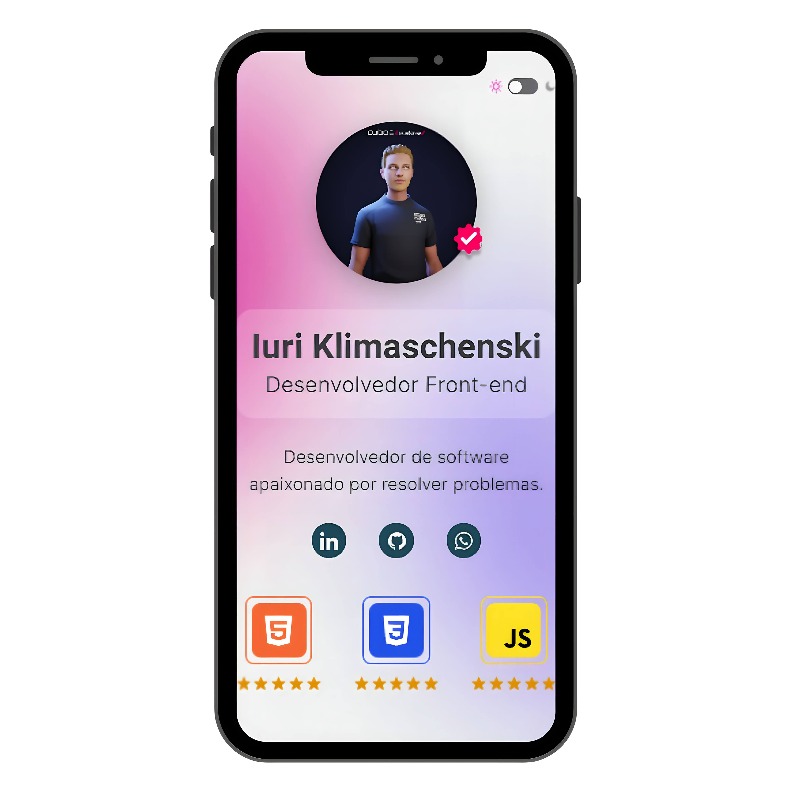
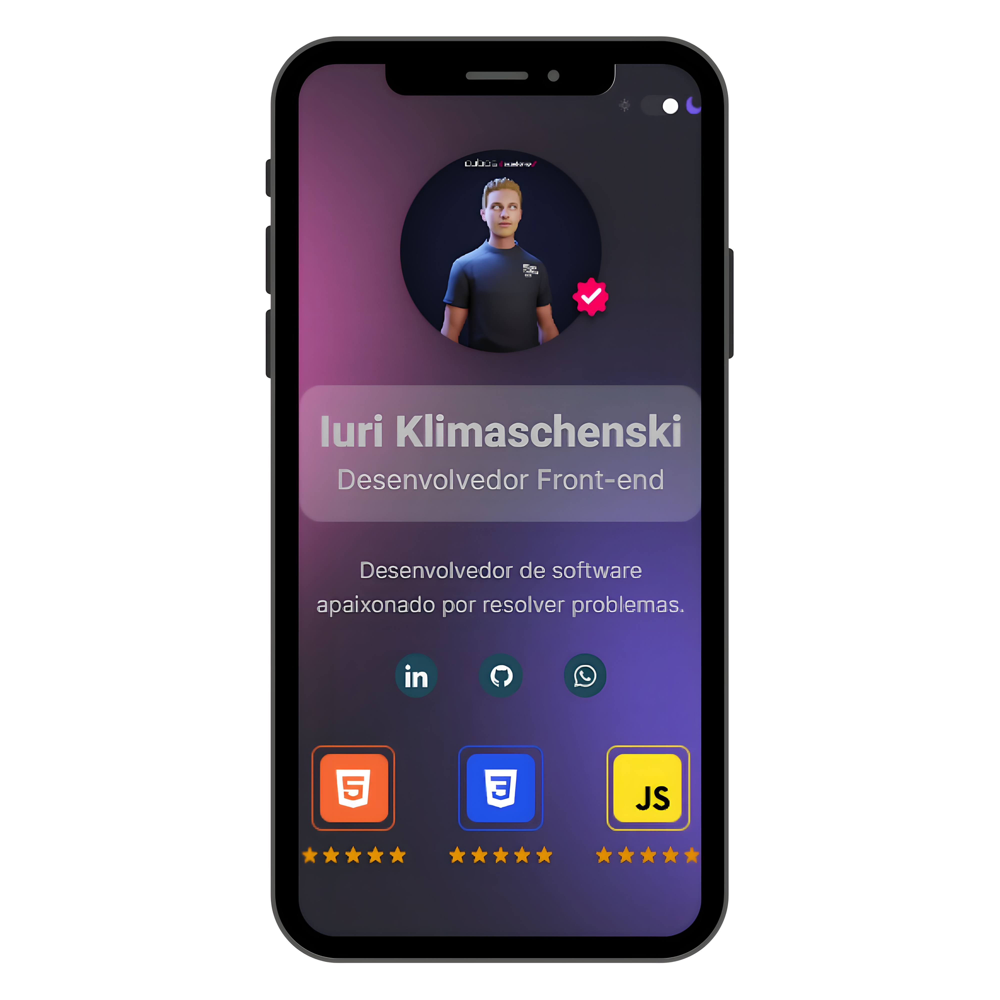

# Tela de Apresentação Dev

## 📝 Apresentação:
Tela de apresentação de um dev com suas skills, nome e contatos, o usuário também pode optar pelo modo claro ou escuro clicando no interruptor.
Projeto vanilla com o objetivo de aprofundar estilizações em CSS, como: position, variáveis, pseudo-classes e funções do background.
A estrutura e estilização foram feitas com HTML & CSS e a linguagem utilizada foi o **Javascript**.

## 🎨 Resultado:
- o resultado pode ser conferido aqui: [**Repl.it**](https://iuriluna.github.io/tela-apresentacao-dev/) 

## 🔨Feito com:

----

